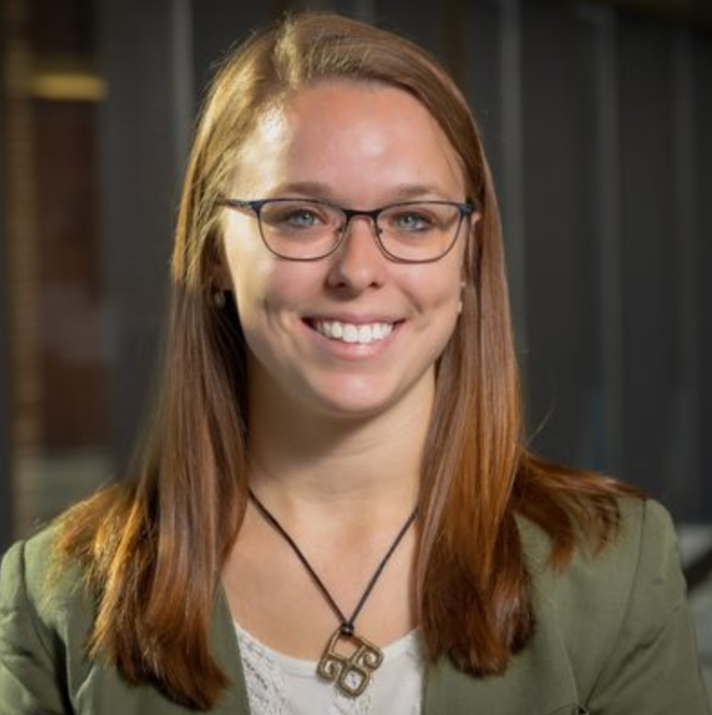
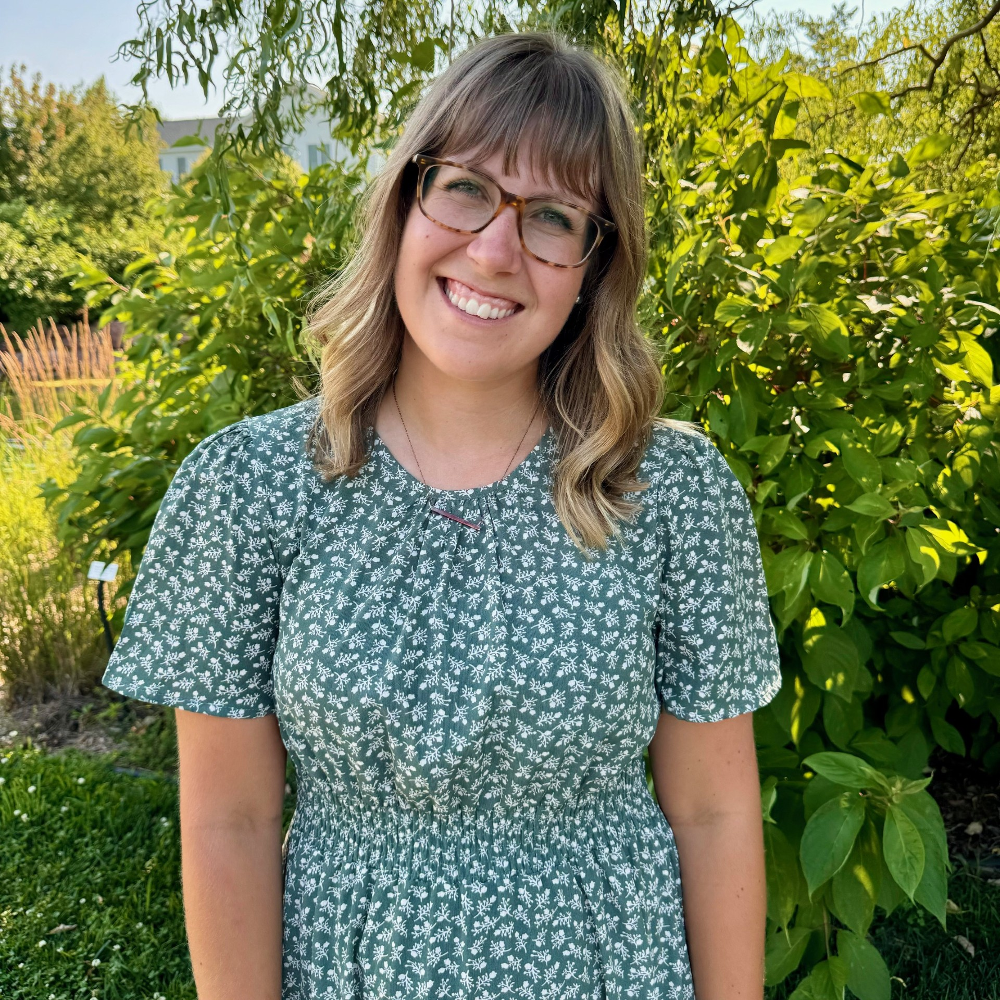
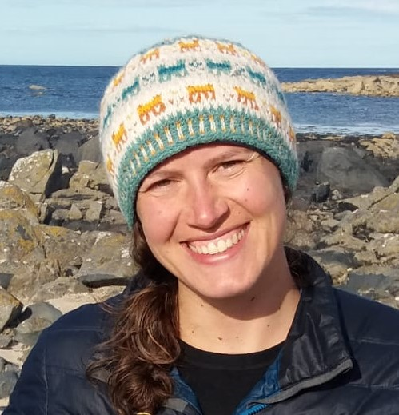
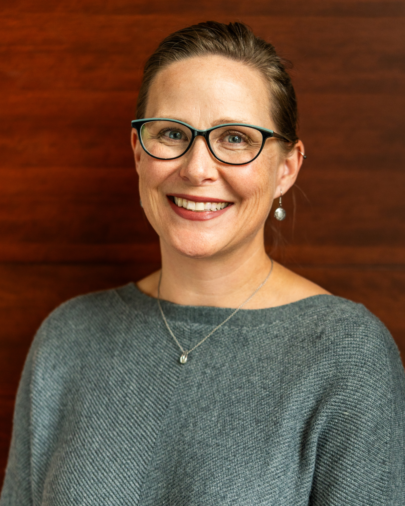
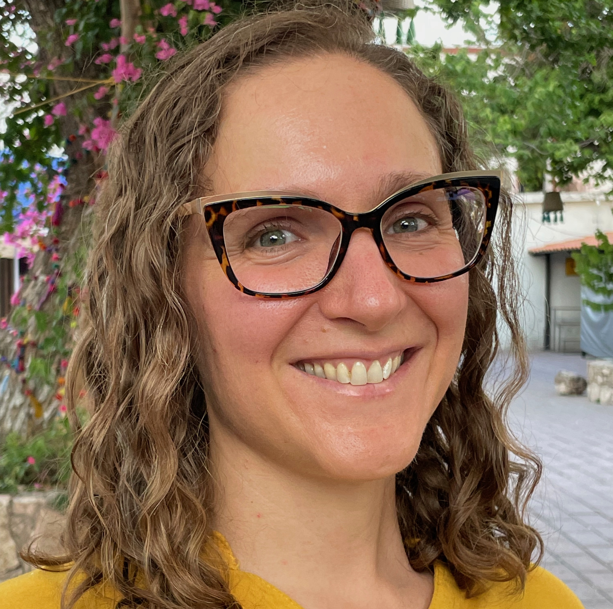
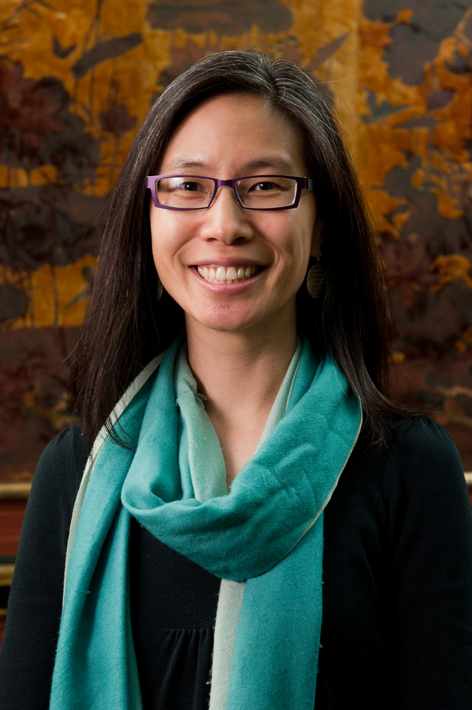
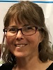
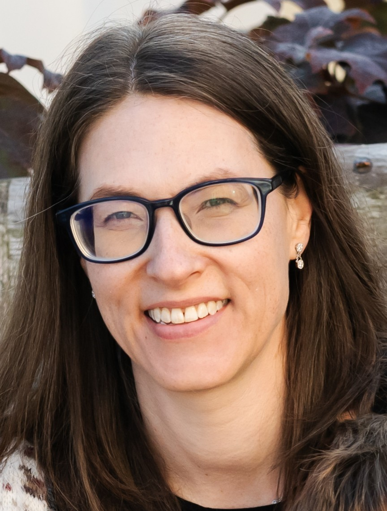

### What are Community Engaged Statistics and Data Science courses?

Courses that use/build statistics and data science skills to co-create sustainable solutions to community-identified questions through partnerships with community members & organizations.

### Who are we?

::: {.grid .people}

::: {.g-col-12 .g-col-md-6}
{fig-alt="Dr. Claire Kelling"}

 **[Dr. Claire Kelling](https://www.clairekelling.com/)**  
 Carleton College  
 [ckelling@carleton.edu](mailto:ckelling@carleton.edu)
:::

::: {.g-col-12 .g-col-md-6}
{fig-alt="Dr. Emily Robinson"}

 **[Dr. Emily A. Robinson](https://statistics.calpoly.edu/Emily-Robinson)**  
 Cal Poly  
 [erobin17@calpoly.edu](mailto:erobin17@calpoly.edu)
:::

::: {.g-col-12 .g-col-md-6}
{fig-alt="Dr. Laurie Baker"}

 **[Dr. Laurie Baker](https://lauriebaker.rbind.io/)**  
 Bates College  
 [lbaker@bates.edu](mailto:lbaker@bates.edu)
:::

::: {.g-col-12 .g-col-md-6}
{fig-alt="Dr. Tyler George"}

 **[Dr. Tyler George](https://stats-tgeorge.github.io/personal_website/)**  
 Cornell College  
 [tgeorge@cornellcollege.edu](mailto:tgeorge@cornellcollege.edu)
:::

::: {.g-col-12 .g-col-md-6}
{fig-alt="Dr. Stacy DeRuiter"}

 **[Dr. Stacy DeRuiter](https://sldr.netlify.app/)**  
 Calvin University
:::

::: {.g-col-12 .g-col-md-6}
{fig-alt="Dr. Rori Rohlfs"}

 **Dr. Rori Rohlfs**  
 Oregon State University
:::

::: {.g-col-12 .g-col-md-6}
{fig-alt="Dr. Ming-Wen An"}

 **[Dr. Ming-Wen An](https://pages.vassar.edu/mian/)**  
 Vassar College
:::

::: {.g-col-12 .g-col-md-6}
{fig-alt="Dr. Karen Benway"}

 **Dr. Karen Benway**  
 University of Vermont
:::

::: {.g-col-12 .g-col-md-6}
{fig-alt="Dr. Gretchen Martinet"}

 **Dr. Gretchen Martinet**  
 University of Virginia
:::
:::